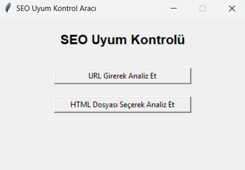

# 🕵️‍♂️ SEO Uyum Kontrol Aracı

Bu Python tabanlı masaüstü uygulama, web sayfalarının temel SEO kriterlerine ne kadar uygun olduğunu analiz etmek için geliştirilmiştir.  
Uygulama sayesinde kullanıcılar ister bir **URL** girerek, ister **HTML dosyası** seçerek SEO uyumluluğunu anlık olarak kontrol edebilir.

---

## 🚀 Özellikler

- 📝 `<title>` ve `<meta description>` uzunluğu kontrolü  
- 🔠 `<h1>` etiketi var mı?  
- 🖼️ Görsellerin `alt` etiketi eksik mi?  
- 🌐 URL ya da yerel HTML dosyası ile analiz  
- 🖥️ Tkinter tabanlı kullanıcı dostu arayüz  
- 🐍 Tamamen Python ile yazıldı

---

## 📸 Uygulama Arayüzü

  


## 🛠️ Gereksinimler

- Python 3.8 veya üzeri
- `requests` kütüphanesi
- `beautifulsoup4` kütüphanesi

Kurulum (terminalde çalıştır):

```bash
pip install requests beautifulsoup4
